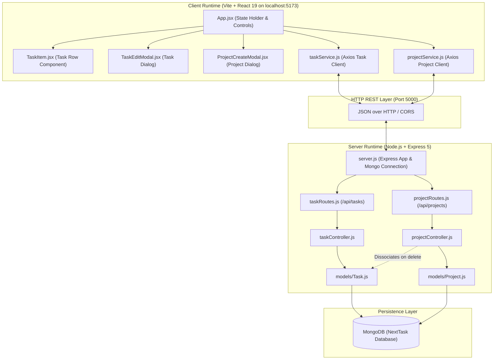
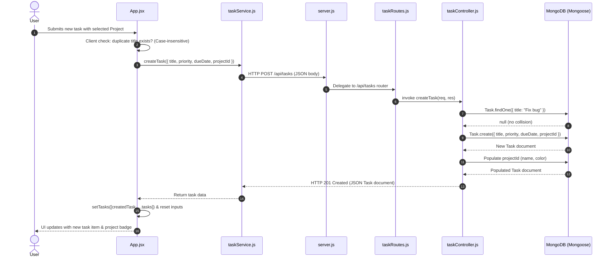
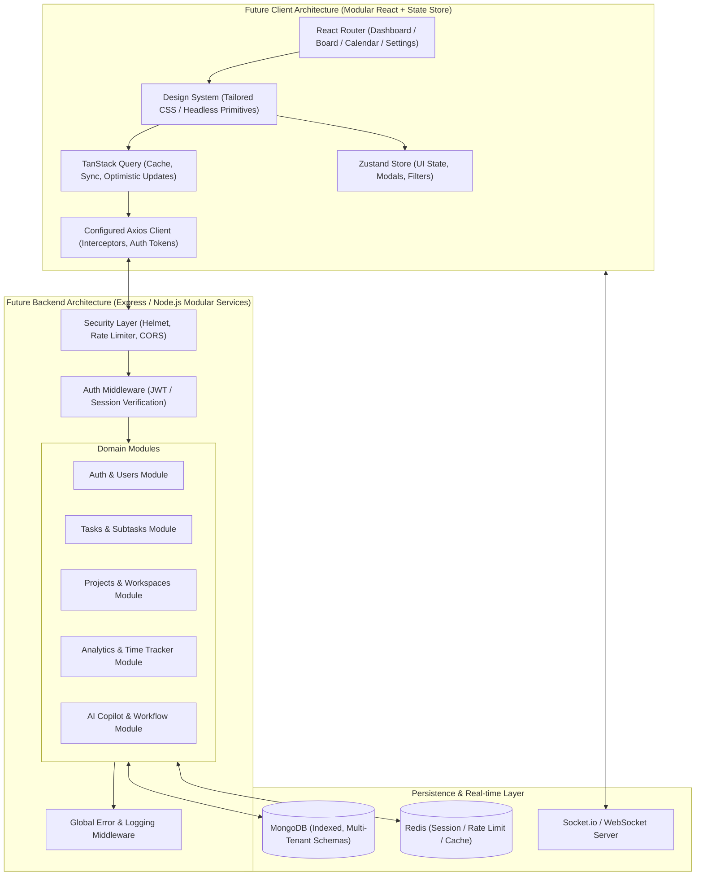

# NextTask — Architecture Documentation

## 1. Repository Structure

NextTask is organized as a decoupled multi-folder repository with independent client and server runtimes:

```
NextTask/
├── .git/                      # Git version control metadata
├── .gitignore                 # Root Git ignore rules
├── client/                    # Frontend single-page application (SPA)
│   ├── public/                # Static public assets (favicon.svg, icons.svg)
│   ├── src/
│   │   ├── components/        # React presentation components
│   │   │   ├── ProjectCreateModal.jsx # Modal dialog for creating projects
│   │   │   ├── TaskEditModal.jsx      # Full task editing modal dialog
│   │   │   └── TaskItem.jsx           # Individual task row with status, meta, and actions
│   │   ├── services/          # API communication abstraction layer
│   │   │   ├── projectService.js      # Axios HTTP calls to project endpoints
│   │   │   └── taskService.js         # Axios HTTP calls to task endpoints
│   │   ├── App.css            # Studio Slate application styles and responsive rules
│   │   ├── App.jsx            # Main root application component, filter/search state
│   │   ├── index.css          # Design system CSS tokens, typography, and primitives
│   │   └── main.jsx           # React root initialization (StrictMode)
│   ├── index.html             # Client HTML entry point
│   ├── package.json           # Client dependencies & scripts (Vite, React 19, Lucide)
│   ├── vite.config.js         # Vite bundler configuration
│   └── .oxlintrc.json         # Oxlint static analysis configuration
├── server/                    # Backend REST API service
│   ├── controllers/           # Request handlers and business logic
│   │   ├── projectController.js # CRUD handlers for projects + safe task dissociation
│   │   └── taskController.js    # CRUD handlers for tasks with project populate/filter
│   ├── models/                # Mongoose schema definitions
│   │   ├── Project.js         # Project schema & model definition
│   │   └── Task.js            # Task schema with projectId ref, tags, subtasks
│   ├── routes/                # Express route declarations
│   │   ├── projectRoutes.js   # Project endpoint mappings (/api/projects)
│   │   └── taskRoutes.js      # Task endpoint mappings (/api/tasks)
│   ├── .env                   # Server environment variables (local)
│   ├── .env.example           # Environment template for server setup
│   ├── package.json           # Clean server dependencies (Express 5, Mongoose 9)
│   └── server.js              # Express app initialization, Mongo connection, route mounting
├── context/                   # Project memory, architecture & guidelines (this folder)
└── specs/                     # Master roadmap, system audits & feature specs
```

---

## 2. Actual Current Architecture



---

## 3. Frontend Architecture

### 3.1 Framework & Tooling
- **React 19 (`^19.2.7`)**: Modern React functional components utilizing hooks (`useState`, `useEffect`).
- **Vite 8 (`^8.1.1`)**: ES-module-based development server providing near-instantaneous Hot Module Replacement (HMR).
- **Styling Architecture**: Vanilla CSS using CSS variables in [index.css](file:///d:/KKS/1.%20AProject/NextTask/client/src/index.css) and component/layout rules in [App.css](file:///d:/KKS/1.%20AProject/NextTask/client/src/App.css).

### 3.2 Component Responsibilities
- **[App.jsx](file:///d:/KKS/1.%20AProject/NextTask/client/src/App.jsx)**:
  - Serves as the primary container and single source of truth for task state.
  - Manages component state:
    - `tasks` (Array): Array of task objects loaded from the API.
    - `newTask` (String): Temporary draft title for new task creation.
    - `newPriority` (String): Selected priority (`low`, `medium`, `high`).
    - `newDueDate` (String): Selected date string from `<input type="date">`.
  - Computes derived statistics: `total`, `completed`, `remaining`.
  - Handles top-level CRUD actions: `addTask`, `deleteTask`, `toggleComplete`, `editTask`.
  - Performs initial task fetching on mount via `useEffect`.
- **[TaskItem.jsx](file:///d:/KKS/1.%20AProject/NextTask/client/src/components/TaskItem.jsx)**:
  - Responsible for displaying individual task rows and managing localized edit mode.
  - Manages internal state:
    - `editing` (Boolean): Controls whether standard row or inline input field is rendered.
    - `editTitle` (String): Temporary edit buffer for the task title.
  - Keyboard accessibility: `Enter` triggers `saveEdit()`, `Escape` triggers `cancelEditing()`.
  - Invokes parent callbacks: `toggleComplete`, `deleteTask`, `editTask`.

### 3.3 Service-Layer Responsibilities
- **[taskService.js](file:///d:/KKS/1.%20AProject/NextTask/client/src/services/taskService.js)**:
  - Encapsulates task network communication using Axios.
  - Base URL resolved dynamically from `import.meta.env.VITE_API_URL` with fallback to `http://localhost:5000/api/tasks`.
  - Methods:
    - `getTasks(filterParams)`: Sends `GET /api/tasks` (with optional `projectId` query).
    - `createTask(data)`: Sends `POST /api/tasks` with title, priority, dueDate, and optional `projectId`.
    - `updateTask(id, updates)`: Sends `PUT /api/tasks/:id`.
    - `deleteTask(id)`: Sends `DELETE /api/tasks/:id`.
- **[projectService.js](file:///d:/KKS/1.%20AProject/NextTask/client/src/services/projectService.js)**:
  - Encapsulates project network communication using Axios.
  - Base URL resolved dynamically with fallback to `http://localhost:5000/api/projects`.
  - Methods:
    - `getProjects()`: Sends `GET /api/projects`.
    - `createProject(data)`: Sends `POST /api/projects` with name, description, and color.
    - `updateProject(id, data)`: Sends `PUT /api/projects/:id`.
    - `deleteProject(id)`: Sends `DELETE /api/projects/:id`.

---

## 4. Backend Architecture

### 4.1 Framework & Runtime
- **Node.js with ES Modules**: Server codebase utilizes native ECMAScript modules (`"type": "module"` in `package.json`), using `import`/`export` syntax.
- **Express.js (`^5.2.1`)**: Express 5 application setup with standard middleware:
  - `cors()`: Enables cross-origin requests from client origins.
  - `express.json()`: Parses incoming payloads with `Content-Type: application/json`.
- **Entry Point ([server.js](file:///d:/KKS/1.%20AProject/NextTask/server/server.js))**:
  - Initializes Express application.
  - Connects to MongoDB via Mongoose using `process.env.MONGO_URI`.
  - Mounts routes at `/api/tasks` and `/api/projects`.
  - Exposes health endpoint: `GET /` responding with `"NextTask API is Running!"`.
  - Listens on parameterized `process.env.PORT || 5000`.

### 4.2 Route-Controller-Model Relationship
1. **Route Layer**:
   - **[taskRoutes.js](file:///d:/KKS/1.%20AProject/NextTask/server/routes/taskRoutes.js)**:
     - `GET /` ➔ `getTasks` (supports `?projectId=...` and `?projectId=inbox`)
     - `POST /` ➔ `createTask`
     - `PUT /:id` ➔ `updateTask`
     - `DELETE /:id` ➔ `deleteTask`
   - **[projectRoutes.js](file:///d:/KKS/1.%20AProject/NextTask/server/routes/projectRoutes.js)**:
     - `GET /` ➔ `getProjects`
     - `POST /` ➔ `createProject`
     - `PUT /:id` ➔ `updateProject`
     - `DELETE /:id` ➔ `deleteProject`
2. **Controller Layer**:
   - **[taskController.js](file:///d:/KKS/1.%20AProject/NextTask/server/controllers/taskController.js)**:
     - `getTasks`: Queries tasks with optional `projectId` filtering (`inbox` filters for `projectId: null`), populates `projectId` with `name` and `color`, sorts descending by `createdAt`.
     - `createTask`: Checks title, validates non-duplicate, creates document, populates `projectId`, returns `201`.
     - `updateTask`: Validates and updates with `runValidators: true`, populates `projectId`, returns updated document.
     - `deleteTask`: Removes task document by ID.
   - **[projectController.js](file:///d:/KKS/1.%20AProject/NextTask/server/controllers/projectController.js)**:
     - `getProjects`: Queries active projects (`isArchived: false`), sorted by `createdAt`.
     - `createProject`: Validates name uniqueness and valid hex color, creates project, returns `201`.
     - `updateProject`: Validates fields and updates project with `runValidators: true`.
     - `deleteProject`: Safely dissociates all associated tasks (`Task.updateMany({ projectId: id }, { projectId: null })`), then deletes the project document.
3. **Model Layer**:
   - **[Task.js](file:///d:/KKS/1.%20AProject/NextTask/server/models/Task.js)**:
     - `title`: String, required, trimmed.
     - `completed`: Boolean, default `false`.
     - `priority`: String, enum `["low", "medium", "high"]`, default `"medium"`.
     - `dueDate`: Date, default `null`.
     - `projectId`: ObjectId ref `Project`, default `null` (indexed for query performance).
     - `tags`: Array of strings, default `[]`.
     - `subtasks`: Array of `{ title: String, completed: Boolean }`, default `[]`.
     - `timestamps`: `true` (`createdAt`, `updatedAt`).
   - **[Project.js](file:///d:/KKS/1.%20AProject/NextTask/server/models/Project.js)**:
     - `name`: String, required, trimmed, unique.
     - `description`: String, trimmed, max 280 chars, default `""`.
     - `color`: String, hex format (`/^#[0-9A-Fa-f]{6}$/`), default `"#6366f1"`.
     - `isArchived`: Boolean, default `false`.
     - `timestamps`: `true` (`createdAt`, `updatedAt`).

---

## 5. Current Request-Response Flow



---

## 6. Environment Variables & Configuration

### Current Server Environment ([server/.env](file:///d:/KKS/1.%20AProject/NextTask/server/.env))
| Variable | Current Value | Required | Purpose |
| :--- | :--- | :--- | :--- |
| `MONGO_URI` | `mongodb://127.0.0.1:27017/NextTask` | Yes | MongoDB connection string |
| `PORT` | `5000` | No (Default: 5000) | Express server listening port |

### Client Environment Setup
- Client resolves API base URLs from `import.meta.env.VITE_API_URL` when provided in client `.env`, gracefully falling back to `http://localhost:5000/api`.
- Both `client/.env.example` and `server/.env.example` are committed to the repository for clear onboarding.

---

## 7. Current Technical Limitations & Architectural Debt

1. **Global Title Uniqueness Bottleneck**:
   - `taskController.js` checks `Task.findOne({ title: title.trim() })`. If any task in the entire database has the title "Meeting", no other task can use that title. In multi-user or categorized contexts, this will be scoped per-project / per-user in subsequent stages.
2. **Client-Side Notifications**:
   - UI has been upgraded with toast notifications for errors and actions, but needs global error boundary handling.
3. **Automated Testing Suite**:
   - Formal test runner (e.g. Vitest / Jest / Supertest) should be introduced for regression testing as milestone complexity scales.

---

## 8. Proposed Future Architecture Evolution



### Architectural Milestones for Future Evolution:
1. **Stabilized Foundation**: Environment variable decoupling, validation middleware, clean package manifests, and consistent error schemas.
2. **Entity Expansion**: Introducing `User`, `Workspace`, `Project`, and `Tag` models with Mongoose relationships (`ref` and indexed `ObjectId` foreign keys).
3. **Data Access & Caching Layer**: Adopting TanStack Query on the client to automate background refetching, mutation rollbacks, and server state caching.
4. **Security & Authentication**: Adding stateless JWT authentication, password hashing (bcrypt), token rotation, and per-user data isolation.
5. **Real-time Synchronization**: Introducing WebSockets for live task updates, collaborative board movements, and time-tracking synchronization.
