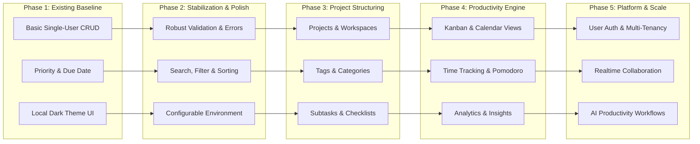

# NextTask — Project Overview

## 1. Vision and Purpose
NextTask is envisioned as a complete, scalable, modern productivity platform engineered to empower individuals and teams to organize, plan, track, and optimize their daily output. 

While the project originates as a focused MERN-based task tracker (Todo application), its strategic trajectory is to transcend basic task lists and evolve into an intelligent, multi-dimensional productivity operating system. The platform will bridge actionable task execution, temporal scheduling, workflow visualization, productivity analytics, team collaboration, and automated/AI-assisted planning—scaling well beyond predecessors like ShelfLife in architecture, maintainability, performance, and feature breadth.

---

## 2. Current Project Status
- **Current Stage**: Stage 0 / Pre-stabilization Baseline.
- **Repository State**: Working decoupled frontend ([client](file:///d:/KKS/1.%20AProject/NextTask/client)) and backend ([server](file:///d:/KKS/1.%20AProject/NextTask/server)) supporting core single-entity task lifecycle operations.
- **Immediate Focus**: Establishing architectural documentation, code standards, system audits, and stabilizing existing features before new feature development begins.

---

## 3. Verified Implemented Features vs. Planned Direction

To maintain absolute architectural integrity, NextTask strictly distinguishes verified working code from forward-looking product concepts.

### Verified Implemented Features (Present in Codebase)
The following capabilities are implemented and verified directly within the repository:
1. **Task Retrieval (Read)**:
   - Fetches all task documents from MongoDB via `GET /api/tasks`.
   - Displays task list in the React UI with title, completion state, priority badge, and formatted due date.
2. **Task Creation (Create)**:
   - Input field with keyboard trigger (`Enter`) and submit button (`+`).
   - Priority selection (`low`, `medium`, `high`, defaulting to `medium`).
   - Due date assignment via HTML5 date picker.
   - Client-side and server-side duplicate title prevention (exact/case-insensitive match checks).
   - Persisted via `POST /api/tasks`.
3. **Task Completion Toggling (Update)**:
   - Interactive checkbox toggle sending `PUT /api/tasks/:id` with `{ completed: !task.completed }`.
   - Dynamic strikethrough styling and opacity reduction upon completion.
4. **Task Title In-Place Editing (Update)**:
   - Inline edit mode activated by pencil icon button.
   - Text input with auto-focus, `Enter` to save, `Escape` to cancel, or dedicated save/cancel buttons.
   - Dispatches `PUT /api/tasks/:id` with `{ title }`.
5. **Task Deletion (Delete)**:
   - Deletion trigger via cross button, executing `DELETE /api/tasks/:id`.
   - Instant client state update removing task from UI.
6. **Task Metric Summary**:
   - Real-time client-side calculation of `Total`, `Completed`, and `Remaining` task counts.
7. **Responsive Dark UI**:
   - Dark theme layout designed with plain CSS, flexbox, mobile media queries, and priority color badges.

### Planned Product Features (Not Yet Implemented)
The following concepts represent future phases on the product roadmap:
- User Authentication & Multi-Tenancy (JWT/Session, Auth0/Supabase/Custom, role-based access).
- Projects, Workspaces, and Contexts.
- Hierarchical Subtasks and Task Dependencies.
- Categories, Tags, and Custom Labels.
- Recurring Tasks (cron-like recurring schedules, habits).
- Multi-View Layouts (Kanban Board, Interactive Calendar, Timeline/Gantt).
- Time Tracking & Pomodoro Focus Timer.
- Deep Productivity Analytics, Velocity Charts, and Habit Streaks.
- Cross-Device Notifications, Due-Date Alerts, and Reminders.
- Real-time Multi-user Collaboration and Activity Feeds (WebSockets/SSE).
- AI Productivity Copilot (natural language task parsing, smart auto-prioritization, automated task decomposition).
- Workflow Automations and Webhooks (GitHub, Slack, Google Calendar).
- Progressive Web App (PWA) and Offline Caching.

---

## 4. Target Users
1. **Solo Knowledge Workers & Developers**: Need a distraction-free, fast, and structured hub to capture tasks, assign priorities, and link work items to deadlines.
2. **Productivity Enthusiasts**: Users who organize life and work through methodologies such as Getting Things Done (GTD), Time Blocking, or Pomodoro.
3. **Small Teams & Collaborators (Future Phase)**: Teams requiring shared workspaces, transparent task ownership, Kanban workflows, and collective velocity tracking.

---

## 5. Core Problems NextTask Aims to Solve
- **Fragmented Tooling**: Eliminating the disconnect between simple todo checklists, calendar views, time trackers, and project boards by uniting them into a single coherent interface.
- **Cognitive Overload**: Reducing friction in capturing, organizing, and prioritizing incoming tasks through intuitive inputs, intelligent defaults, and automated suggestions.
- **Lack of Actionable Insights**: Providing concrete data on personal productivity trends rather than static, passive lists that easily become overwhelming graveyards of stale tasks.
- **Bloat vs. Speed**: Maintaining lightning-fast response times, micro-interactions, and keyboard ergonomics while supporting deep platform capability.

---

## 6. Product Principles
1. **Speed and Responsiveness First**: Every user action (capture, edit, toggle, filter) must feel immediate. UI state updates should be optimistic where safe.
2. **Zero Ambiguity & Data Integrity**: Data state must remain strictly synchronized between client and database. No silent errors or unhandled edge cases.
3. **Progressive Disclosure**: Keep default views clean, elegant, and focused. Expose advanced attributes (dependencies, time logs, recurring rules) contextually when needed.
4. **Intentional, Modern Aesthetic**: Build polished, tactile, and visually refined interfaces with cohesive typography, harmonious color accents, and smooth micro-transitions.
5. **Architectural Discipline**: Maintain clear domain separation, explicit service boundaries, comprehensive error handling, and modular component composition.

---

## 7. Current Technology Stack

| Layer | Technology | Version | Purpose in Codebase |
| :--- | :--- | :--- | :--- |
| **Frontend Framework** | React | `^19.2.7` | UI component tree, local state, DOM reconciliation |
| **Client Bundler / Dev**| Vite | `^8.1.1` | Fast HMR, ESM bundling, client dev server |
| **HTTP Client** | Axios | `^1.19.0` | API communication with backend |
| **Client Linter** | Oxlint | `^1.71.0` | Fast Rust-based JavaScript linting |
| **Styling** | Vanilla CSS | Custom | Custom dark theme styling in `App.css` and `index.css` |
| **Backend Runtime** | Node.js (ESM) | `v18+` / `v20+` | JavaScript runtime using `"type": "module"` |
| **Backend Framework** | Express.js | `^5.2.1` | REST API routing, JSON middleware, HTTP server |
| **Database ODM** | Mongoose | `^9.9.2` | Schema definition, validation, MongoDB object modeling |
| **Database Engine** | MongoDB | Local / Atlas | Document-oriented NoSQL persistence store |
| **CORS Middleware** | cors | `^2.8.6` | Cross-Origin Resource Sharing handling |
| **Environment Config** | dotenv | `^17.4.2` | Loads environment variables from `.env` |

---

## 8. Potential Future Technology Choices

| Area | Potential Technology | Rationale |
| :--- | :--- | :--- |
| **Type Safety** | TypeScript | Strong typing across API contracts, models, and UI props to prevent runtime regressions. |
| **Client State / Cache** | TanStack Query (React Query) | Server-state caching, optimistic mutations, automatic background refetching, and pagination. |
| **Client UI Routing** | React Router v7 | Multi-page routing for dashboard, calendar, kanban, project, and settings views. |
| **Global UI State** | Zustand | Lightweight client-only store for UI state (sidebars, active modal, active filters). |
| **Component Primitives** | Radix UI / Headless UI | Unstyled, accessible primitives (dialogs, dropdowns, tooltips, popovers). |
| **Validation Layer** | Zod | Unified client and server schema validation for API payloads. |
| **Authentication** | JWT + bcrypt / Argon2 | Secure session management, password hashing, and user credential verification. |
| **Real-Time Layer** | Socket.io / WebSockets | Live multi-user collaboration and instant synchronization across devices. |
| **Automated Testing** | Vitest, Supertest, Playwright | Unit testing, backend API integration testing, and end-to-end browser testing. |
| **Deployment / Cloud** | Docker, Nginx, Render / AWS | Containerized multi-service deployment with reverse proxying and SSL termination. |

---

## 9. MVP vs. Long-Term Evolution Matrix

- **Baseline (Current)**: Single-user flat task list with in-place edit, completion toggle, priority badge, and due date.
- **Short-Term Target**: Defect stabilization, unified error handling, client feedback, filtering/sorting, and environment variable sanitation.
- **Mid-Term Target**: Multi-entity architecture (Projects, Tags, Subtasks), diverse productivity views (Kanban board, Calendar), and user authentication.
- **Long-Term Target**: AI-augmented planning, collaborative workspaces, automated webhooks, analytics dashboards, and production cloud infrastructure.
