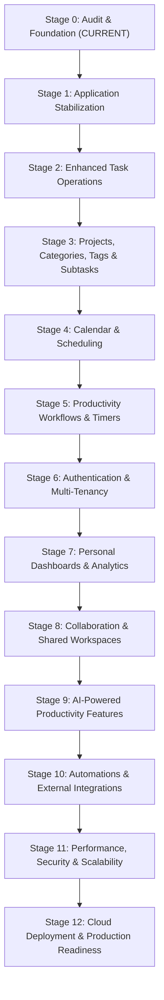

# NextTask — Master Product & Engineering Roadmap

## 1. Roadmap Strategy & Evolution Philosophy

The NextTask master roadmap defines a systematic, multi-phase trajectory transforming a single-user MERN Todo application into an enterprise-grade productivity platform. Every stage builds sequentially upon previously verified foundations.

---

## 2. Staged Roadmap Breakdown

### Stage 0: Repository Audit & Architectural Foundation (CURRENT)
- **Objective**: Conduct an exhaustive audit of client and server codebases, establish project memory (`context/`), create structured feature specifications (`specs/`), and define coding standards.
- **User Value**: Zero regression risk and transparent architectural documentation for reliable ongoing development.
- **Features**: Complete codebase audit, technical debt cataloging, ADR creation, roadmap authoring, and specification templates.
- **Dependencies**: Existing code in `client/` and `server/`.
- **Technical Considerations**: No code modifications; purely analytical and documentation-driven.
- **Risks**: Making assumptions without inspecting source code (mitigated by line-by-line verification).
- **Testing Requirements**: Verification of documentation markdown formatting and file paths.
- **Completion Criteria**: All `context/` and `specs/` documents and root `README.md` are present and consistent.
- **Explicitly Excluded**: Any feature implementation or code alteration.

---

### Stage 1: Current Application Stabilization
- **Objective**: Resolve known bugs, configuration issues, styling clashes, and technical debt in the existing codebase.
- **User Value**: Reliable task creation with clear error feedback, robust backend validation, and consistent dark UI styling.
- **Features**:
  - Correct `runValidators` casing in `taskController.js`.
  - Environment variable parameterization (`PORT` on server, `VITE_API_URL` on client).
  - Clean server dependencies (remove unused React/Vite packages, add nodemon dev script).
  - Client-side error notifications (visual feedback on duplicate title or network failure).
  - CSS `#root` layout conflict reconciliation between `index.css` and `App.css`.
  - Review and refine title uniqueness logic.
- **Dependencies**: Stage 0 baseline.
- **Technical Considerations**: Surgical code edits without modifying core component structure.
- **Risks**: Breaking existing task creation or deletion during cleanup.
- **Testing Requirements**: Manual CRUD verification, Oxlint validation, server restart test with custom PORT.
- **Completion Criteria**: Zero console errors, responsive layout without conflicting CSS, and passing lint checks.
- **Explicitly Excluded**: New data entities (projects, tags) or user authentication.

---

### Stage 2: Enhanced Task Operations
- **Objective**: Upgrade single-task capabilities to support search, sorting, filtering, and rich editing.
- **User Value**: Quick location of urgent tasks, flexible prioritization, and editing all task attributes.
- **Features**:
  - Filter tabs: `All`, `Active`, `Completed`.
  - Sorting options: By Due Date (ascending/descending), Priority (high to low), and Creation Date.
  - Search bar with instant real-time title filtering.
  - Comprehensive Task Edit Modal (enabling modification of title, priority, and due date).
  - Bulk actions: "Clear Completed" and "Mark All as Complete".
- **Dependencies**: Stage 1 stabilization.
- **Technical Considerations**: Keep sorting and filtering responsive in memory or pass query parameters (`?status=&sort=`) to the backend.
- **Risks**: UI clutter if filter/sort controls are not designed cleanly.
- **Testing Requirements**: Filter accuracy tests, sorting edge cases (null due dates), modal accessibility.
- **Completion Criteria**: Users can filter, search, sort, and fully edit any task attribute seamlessly.
- **Explicitly Excluded**: Hierarchical subtasks or multi-user access.

---

### Stage 3: Projects, Categories, Tags & Subtasks
- **Objective**: Evolve the single-list model into a structured hierarchy of workspaces, projects, categories, tags, and subtasks.
- **User Value**: Organize complex goals into structured projects with modular subtask checklists.
- **Features**:
  - `Project` entity: title, description, color tag, and task associations.
  - `Subtask` support: checklist items embedded in or referenced by tasks with individual completion states.
  - `Tags` / `Labels`: color-coded labels (e.g., `#work`, `#personal`, `#urgent`) with multi-tag assignment.
  - Project sidebar navigation and task filtering by project or tag.
- **Dependencies**: Stage 2 enhanced task operations.
- **Technical Considerations**: Mongoose schema relationships (`ref: "Project"` on Task; embedded subtask schemas).
- **Risks**: Schema migration complexities for existing tasks without project IDs.
- **Testing Requirements**: Subtask progress calculations, cascading deletion checks, tag assignment tests.
- **Completion Criteria**: Ability to group tasks by project, assign tags, and check off subtasks.
- **Explicitly Excluded**: Team sharing or permissions on projects.

---

### Stage 4: Calendar & Scheduling
- **Objective**: Introduce temporal productivity views, enabling users to schedule, visualize, and reschedule tasks over time.
- **User Value**: Clear visual overview of daily, weekly, and monthly commitments to prevent deadline collisions.
- **Features**:
  - Interactive Calendar View (Monthly, Weekly, and Day agenda views).
  - Drag-and-drop or date-click task rescheduling.
  - "Upcoming" and "Overdue" Smart Views.
  - Recurring task rules (daily, weekly on specific days, monthly).
- **Dependencies**: Stage 3 projects and due dates.
- **Technical Considerations**: Lightweight date-handling utilities; avoiding heavy legacy libraries (e.g., Moment.js).
- **Risks**: Complex edge cases with timezone offsets and recurring task generation.
- **Testing Requirements**: Timezone conversion tests, leap-year calculations, recurring task occurrence logic.
- **Completion Criteria**: Users can view tasks on a calendar grid and reschedule due dates interactively.
- **Explicitly Excluded**: External Google Calendar bi-directional sync (deferred to Stage 10).

---

### Stage 5: Productivity Workflows & Timers
- **Objective**: Integrate focus and execution methodologies directly into the task environment.
- **User Value**: Bridge task planning with immediate focused execution (Pomodoro, time tracking).
- **Features**:
  - Built-in Pomodoro Focus Timer (25m work / 5m break cycles) linked to the active task.
  - Time tracking: start/stop timer recording total elapsed duration against a task.
  - Kanban Board View: visual stages (`Backlog`, `In Progress`, `Review`, `Done`) with drag-and-drop cards.
  - Daily Focus Mode: a minimalist distraction-free view highlighting the top 3 daily priorities.
- **Dependencies**: Stage 3 & 4 data models.
- **Technical Considerations**: Browser local storage persistence for active timers to survive page refreshes.
- **Risks**: Performance issues with rapid timer intervals if not cleanly decoupled from component trees.
- **Testing Requirements**: Timer accuracy tests, drag-and-drop reordering persistence, state restoration.
- **Completion Criteria**: Users can track elapsed time on tasks and execute Pomodoro cycles within the interface.
- **Explicitly Excluded**: Team billing or invoicing based on time logs.

---

### Stage 6: Authentication & Multi-Tenancy
- **Objective**: Introduce secure user accounts, authentication, authorization, and complete data isolation.
- **User Value**: Protect personal data, enable multi-device access, and support private user profiles.
- **Features**:
  - User registration, login, and secure logout.
  - Password hashing with bcrypt / Argon2.
  - Stateless JWT token issuance and HTTP-only cookie or secure header management.
  - Multi-tenant data scoping: all queries scoped strictly to authenticated `userId`.
  - User profile settings (display name, avatar, theme preference).
- **Dependencies**: Stage 1-5 core features.
- **Technical Considerations**: Auth middleware in Express, protected routes in React client.
- **Risks**: Breaking existing unauthenticated tasks; requires clean database migration or seed migration strategy.
- **Testing Requirements**: Token expiration tests, invalid password rejection, unauthorized route protection.
- **Completion Criteria**: Secure authentication flow with complete data isolation between accounts.
- **Explicitly Excluded**: Enterprise SSO (SAML/Okta) and OAuth multi-provider setup.

---

### Stage 7: Personal Dashboards & Productivity Analytics
- **Objective**: Provide users with actionable visual analytics and velocity metrics regarding their output.
- **User Value**: Deep insight into productivity patterns, completion velocity, and time expenditure.
- **Features**:
  - Personal Dashboard with productivity summary widgets.
  - Completion velocity charts (tasks completed per day/week).
  - Time allocation graphs (hours spent per project/tag).
  - Habit streak tracker and overdue rate metrics.
  - Export data capabilities (JSON, CSV).
- **Dependencies**: Stage 5 time tracking and Stage 6 user accounts.
- **Technical Considerations**: Server-side aggregation pipelines in MongoDB for efficient metric computation.
- **Risks**: Complex aggregation queries causing database latency if proper indexes are absent.
- **Testing Requirements**: MongoDB aggregation pipeline unit tests, graph rendering accuracy.
- **Completion Criteria**: Dashboard renders responsive charts reflecting verified user task history.
- **Explicitly Excluded**: AI predictions (deferred to Stage 9).

---

### Stage 8: Collaboration & Shared Workspaces
- **Objective**: Transition NextTask from a personal tracker into a collaborative team productivity hub.
- **User Value**: Shared project execution, task delegation, team comments, and real-time updates.
- **Features**:
  - Workspaces with role-based access control (Admin, Member, Viewer).
  - Task assignment to team members.
  - Task comments and activity audit logs.
  - Real-time updates via WebSockets (Socket.io) for live board movements and status changes.
- **Dependencies**: Stage 6 authentication and Stage 3 projects.
- **Technical Considerations**: WebSocket server cluster, optimistic UI updates with conflict resolution.
- **Risks**: Race conditions when multiple users edit the same task concurrently.
- **Testing Requirements**: Concurrency tests, WebSocket reconnection tests, permission enforcement tests.
- **Completion Criteria**: Multiple users can collaborate on a shared project with real-time updates.
- **Explicitly Excluded**: Video conferencing or built-in chat.

---

### Stage 9: AI-Powered Productivity Features
- **Objective**: Leverage artificial intelligence to eliminate friction in planning, organizing, and prioritizing tasks.
- **User Value**: Instant smart task capture, automated subtask breakdown, and intelligent priority recommendations.
- **Features**:
  - Natural Language Task Creation: parse "Submit quarterly report next Tuesday at 3pm high priority" into structured task attributes.
  - Smart Subtask Decomposition: AI suggests logical 4-5 step checklists for complex task titles.
  - Intelligent Prioritization Copilot: AI analyzes upcoming deadlines and workloads to recommend daily focus.
  - Daily Morning Briefing: AI-generated summary of key priorities for the day.
- **Dependencies**: Stage 3 (Subtasks), Stage 4 (Dates), Stage 6 (User data).
- **Technical Considerations**: LLM API integration with strict JSON output schemas and rate-limiting safeguards.
- **Risks**: Hallucinations or malformed JSON payloads; cost overruns from unbounded API calls.
- **Testing Requirements**: Prompt output parsing unit tests, latency timeout fallbacks, rate limit handlers.
- **Completion Criteria**: Users can create tasks via natural language and generate subtask checklists on demand.
- **Explicitly Excluded**: Fully autonomous task execution or external web scraping.

---

### Stage 10: Automations & External Integrations
- **Objective**: Connect NextTask with the broader software ecosystem to automate routine workflows.
- **User Value**: Eliminate manual data entry by synchronizing tasks with calendars, repos, and communications.
- **Features**:
  - Webhook triggers and endpoints (e.g., create task when GitHub issue is assigned).
  - Two-way Google Calendar synchronization for due dates.
  - Slack / Discord reminder notifications.
  - Custom rule-based automation engine ("When task marked Done, move to Archive project").
- **Dependencies**: Stage 6 authentication and Stage 8 workspaces.
- **Technical Considerations**: Asynchronous job queue (e.g., BullMQ with Redis) for reliable integration retries.
- **Risks**: Third-party API rate limits and breaking external webhook payloads.
- **Testing Requirements**: Webhook signature verification, retry queue tests, integration mocks.
- **Completion Criteria**: Working webhook triggers and verified Google Calendar synchronization.
- **Explicitly Excluded**: Complex multi-step enterprise ETL pipelines.

---

### Stage 11: Performance, Security & Scalability
- **Objective**: Harden the platform for high-concurrency production usage, enterprise security, and sub-100ms response times.
- **User Value**: Bulletproof data protection, 99.9% uptime, and instant page transitions under heavy data loads.
- **Features**:
  - Redis caching layer for active workspace queries and session lookups.
  - MongoDB database indexing audit, query plan optimizations (`explain()`), and sharding readiness.
  - Security hardening: Helmet HTTP headers, express-rate-limit, input sanitization against NoSQL injection, and CSRF protection.
  - End-to-end automated test suite: Vitest unit tests, Supertest API tests, Playwright browser tests.
- **Dependencies**: All preceding core application stages.
- **Technical Considerations**: Comprehensive CI/CD test automation in GitHub Actions.
- **Risks**: Over-engineering caching layers before traffic warrants it.
- **Testing Requirements**: Load testing under simulated high concurrency (k6/autocannon), security penetration scans.
- **Completion Criteria**: 100% test pass rate in CI, sub-100ms API response times (p95), zero critical security vulnerabilities.
- **Explicitly Excluded**: Multi-region active-active database replication.

---

### Stage 12: Cloud Deployment & Production Readiness
- **Objective**: Package, containerize, and deploy NextTask into a scalable cloud environment.
- **User Value**: High availability, automated continuous deployment, and seamless mobile/desktop access.
- **Features**:
  - Production Dockerfiles with multi-stage builds for client and server.
  - Docker Compose configuration for local multi-container development (client, server, mongo, redis).
  - Progressive Web App (PWA) manifest with service worker caching for offline task viewing.
  - Production deployment pipeline (e.g., AWS / Render / DigitalOcean) with automated SSL and monitoring (Sentry, Prometheus).
- **Dependencies**: Stage 11 hardened codebase.
- **Technical Considerations**: Minimal alpine-based container images, environment secret management.
- **Risks**: Deployment downtime during database migrations.
- **Testing Requirements**: Smoke tests against production builds, container health-check verification.
- **Completion Criteria**: Deployed live production URL with automated SSL, working PWA install prompt, and health monitors.
- **Explicitly Excluded**: Kubernetes multi-cluster orchestration.
